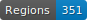
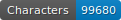

CREMMA - Wikipedia
=====================

   

--- 

[![CC BY 4.0][cc-by-shield]][cc-by] 

## Description

The CREMMA WIKIPEDIA project aims at creating a collection of ground truth to train HTR models on contemporary French handwriting. 

Each image represents an exerpt from a randomly selected Wikipedia page, copied by hand by volunteers. We then took care of the alignment between the handwritten portion and the original text, also present on the image. 

<!--
## Extent

Complete here

## Sources

Complete here.
--->

## Transcription guidelines

The transcription guidelines follow [CREMMA's convention](https://gist.github.com/alix-tz/6f89444521bf1cab0522da520f7e4ff4) for modern documents. In short:
- superscript is preceded by a `^`. 
- Strikethrough elements are transcribed with
	- `><` when unreadable, 
	- `>word<` when readeable.

The text to copy may have included phonetic transcription. Non-french letters and diacritics were rendered as well. See [characters.csv](./characters.csv) for the list of the characters used in this dataset. The character set can be normalized using [ChocoMufin](https://github.com/PonteIneptique/choco-mufin) 

## Related tools

- [wikicremma](https://github.com/PonteIneptique/wikicremma): file generator for the CREMMA-Wikipedia corpus
- [cremmawiki-anonymizer](https://github.com/cremma-wiki/cremmawiki-anonymizer): anonymized image generator for the CREMMA-Wikipedia corpus

## License

This work is licensed under a [Creative Commons Attribution 4.0 International License][cc-by].

[![CC BY 4.0][cc-by-image]][cc-by]

[cc-by]: http://creativecommons.org/licenses/by/4.0/
[cc-by-image]: https://i.creativecommons.org/l/by/4.0/88x31.png
[cc-by-shield]: https://img.shields.io/badge/License-CC%20BY%204.0-lightgrey.svg
