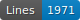
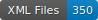

CREMMA - Wikipedia
=====================

    

--- 

[![CC BY 4.0][cc-by-shield]][cc-by]

## Description

The WikiCremma projet aims at creating a collection of ground truth to train HTR models on contemporary French handwriting. 

Each image represents an exerpt from a randomly selected Wikipedia page, copied by hand by volunteers. We then took care of the alignment between the handwritten portion and the original text, also present on the image. 

<!--
## Extent

Complete here

## Transcription guidelines

Complete here.

## Sources

Complete here.
--->

## Related tools

- [wikicremma](https://github.com/PonteIneptique/wikicremma): file generator for the CREMMA-Wikipedia corpus
- [CREMMAWIKI-Anonymizer](https://github.com/alix-tz/CREMMAWIKI_Anonymizer): anonymized image generator for the CREMMA-Wikipedia corpus

## License

This work is licensed under a [Creative Commons Attribution 4.0 International License][cc-by].

[![CC BY 4.0][cc-by-image]][cc-by]

[cc-by]: http://creativecommons.org/licenses/by/4.0/
[cc-by-image]: https://i.creativecommons.org/l/by/4.0/88x31.png
[cc-by-shield]: https://img.shields.io/badge/License-CC%20BY%204.0-lightgrey.svg
